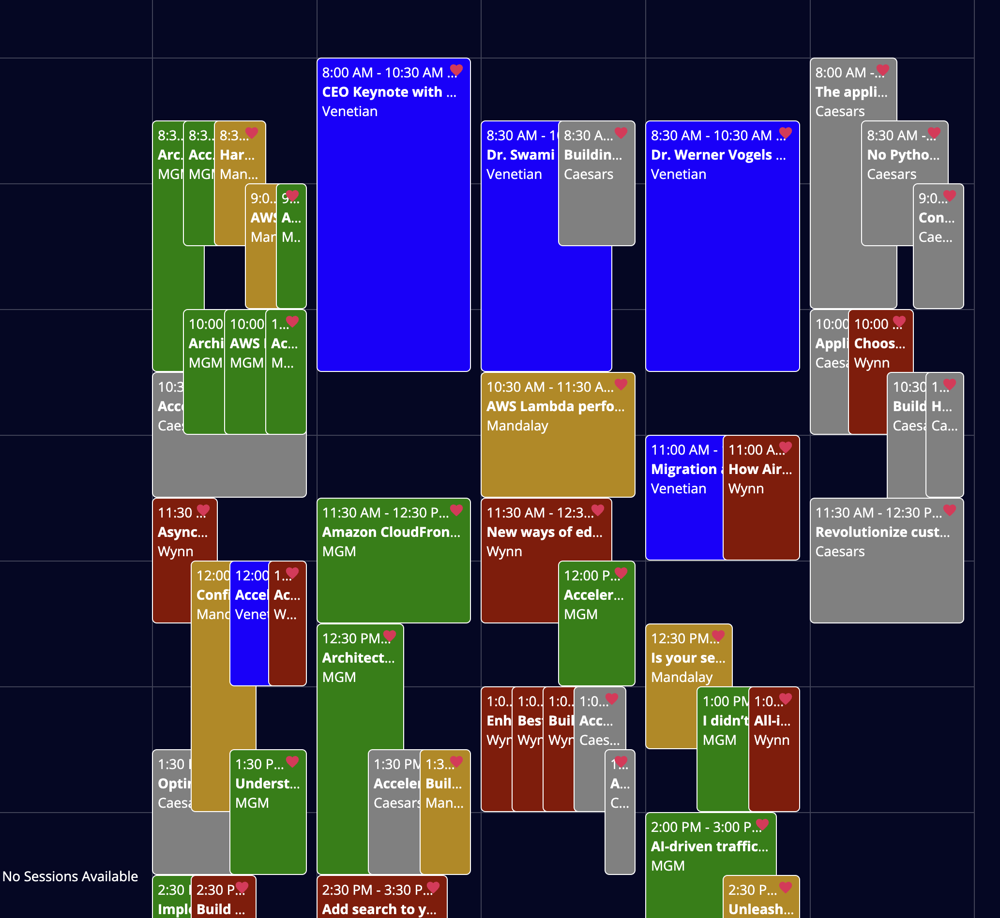
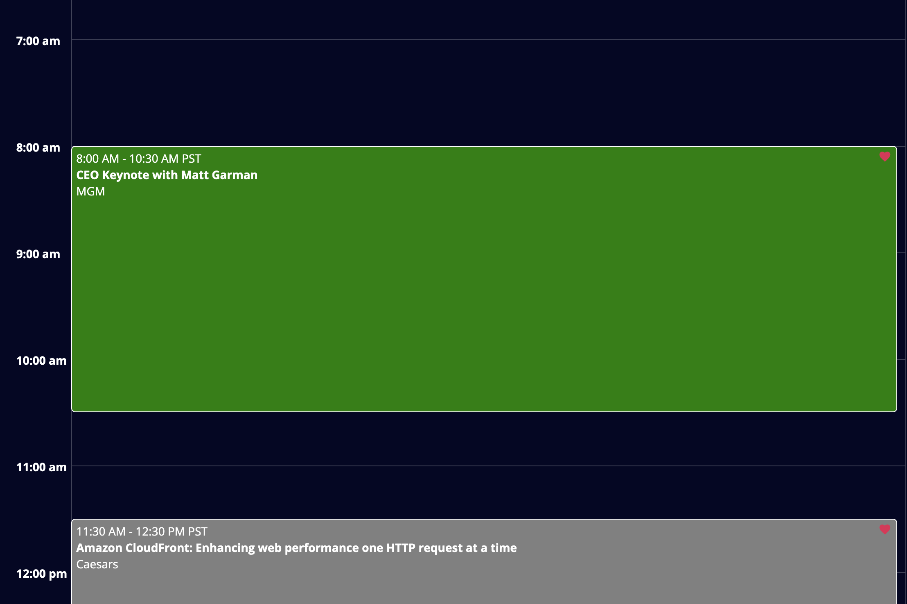

Re:Invent Schedule Fixer
========================

This is a Google Chrome extension. 

[//]: # (You can install this extension by this address: [Chrome Web Store]&#40;https://chrome.google.com/webstore/detail/reinvent-schedule-fixer/uploadpendinghash&#41;.)

The purpose of this extension is to add additional display features to the AWS Re:Invent MyAgenda Scheduler page to make planning your schedule easier. The default view doesn't distinguish in any way the venues without having to click on each item, and when you're planning your schedule, you need to quickly see if you have sessions all over the place which is impractical. This should help.

This extension doesn't collect any user and web page information. It only runs on AWS My Agenda web page. It is free to use.

The list of sessions is using browser memory (AWS did this not me) so some browser memory is used during searching. There is a purposeful 3 second delay before modifying the page to allow everything to load.

### Contributions
Contributions are welcome. Please open an issue or a pull request but this was a quick hobby project so I may not be able to respond quickly. Feel free to buy me a coffee https://buymeacoffee.com/kristhomwh8

## To Install:
Since this was done fast and AWS session sign up is October 8, there's not enough time to submit to Chrome store and have it posted (though I'm still doing that) So you have to just install direct:
1. Download the zip file from the releases page.
2. Go to the url chrome://extensions/
3. Click Load Unpacked on the left
4. Pick the folder you unzipped the package into
5. Visit your My Agenda schedule and click Favorites on

Since this is also done before registration, I'm sure I'll have to make some tweaks after registration starts so check back after for an update.

### Contributors
- [@ktwbc](https://github.com/ktwbc)

### Screenshots:

